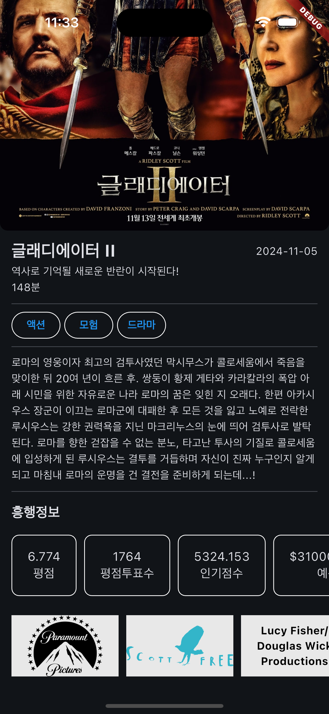

# 영화 정보 앱

    
    
    
    

- 영화의 순위와 정보를 나타내주는 앱 입니다.
- 인기순 1위의 영화의 포스터를 제일 상단에 크게 보여줍니다.
- 현재 상영중인 영화, 인기순, 평점 높은순 개봉 예정인 영화를 각각 20개씩 볼 수 있습니다. 가로 스크롤로 옆으로 넘기면 확인할 수 있습니다.
- 영화 포스터를 클릭하면 영화의 상세한 정보를 볼 수 있습니다.
- 영화 이름, 개봉일, 개요, 러닝타임, 장르, 흥행정보, 제작사를 볼 수 있습니다.